# CMFO Architecture Diagrams

This document contains visual representations of the CMFO system.
You can view these diagrams in any Markdown viewer with Mermaid support (like GitHub or VS Code).

## 1. The Unified Stack (From Theory to App)

This diagram shows how the abstract physics connects to the user's daily life.

```mermaid
graph TD
    subgraph "Level 1: The Unified Field (Theory)"
        U[Unified Object: 𝔘φ] -->|Defines| M[7D Manifold T⁷]
        M -->|Generates| P[Particles & Constants]
        M -->|Enables| L[Reversible Logic]
    end

    subgraph "Level 2: The Core Engine (C++ / CUDA)"
        L -->|Implemented via| ME[Matrix Engine 7x7]
        ME -->|Features| Arith[Complex Arithmetic]
        ME -->|Features| Unit[Unitary Checks]
        ME -->|Features| Opt[GPU Acceleration]
    end

    subgraph "Level 3: The Language Layer (Python)"
        ME -->|Bindings| Py[Python Compiler]
        Py -->|Process| NLP[Natural Language Parser]
        NLP -->|Converts| Text[User Input]
        Text -->|To| Mat[Matrix Operations]
    end

    subgraph "Level 4: User Experience (Practical Revolution)"
        Mat -->|Executes| Act[Action: Automate Task]
        Act -->|Example| E1[Send Email]
        Act -->|Example| E2[Organize Files]
        Act -->|Example| E3[Mine Block O(1)]
    end
    
    style U fill:#f9f,stroke:#333,stroke-width:2px
    style ME fill:#bbf,stroke:#333,stroke-width:2px
    style Act fill:#bfb,stroke:#333,stroke-width:2px
```

## 2. The Deterministic Compiler Pipeline (V2)

How "Juan sees it" becomes a mathematical operation.


## 3. "Mining" vs "Inversion" (The O(1) Breakthrough)

Why CMFO is infinitely faster than Bitcoin mining.

```mermaid
graph LR
    subgraph "Standard Mining (Probabilistic)"
        Start1[Start] --> Guess[Guess Nonce]
        Guess --> Hash[SHA-256]
        Hash --> Check{Target Met?}
        Check -->|No| Guess
        Check -->|Yes| Win1[Block Solved]
        
        style Guess fill:#fbb,stroke:#f00
    end

    subgraph "CMFO Mining (Deterministic)"
        Start2[Start] --> Target[Target Hash]
        Target --> Geo[Map to Manifold]
        Geo --> Inv[Apply Inverse Operator Γ⁻¹]
        Inv --> Nonce[Recovered Nonce]
        Nonce --> Win2[Block Solved]
        
        style Inv fill:#bfb,stroke:#0f0
    end
```


